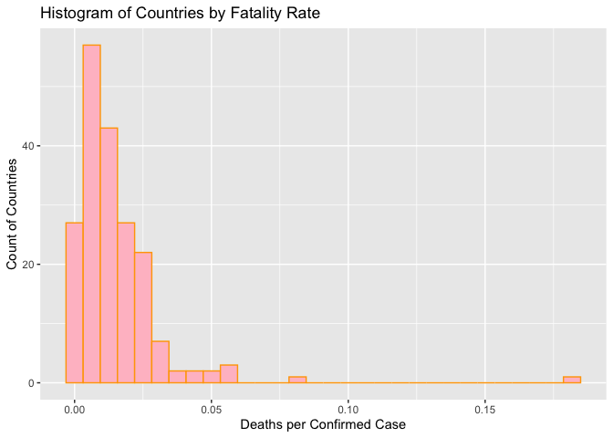
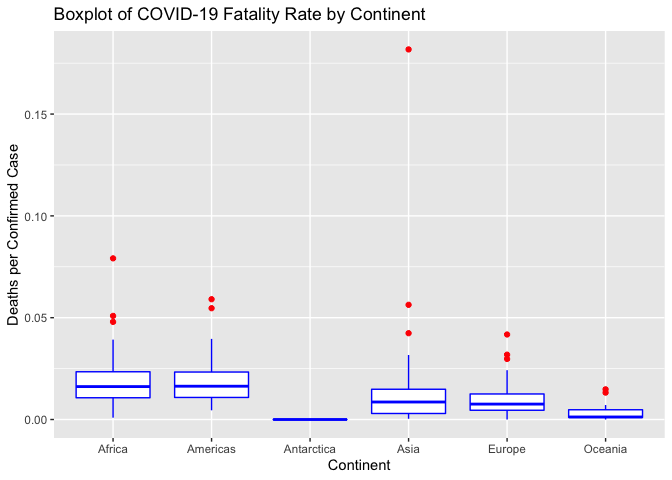

COVID-19 API Vignette
================
C. Donahue
June 26, 2022

-   [Requirements](#requirements)
-   [Functions to Interact With the
    API](#functions-to-interact-with-the-api)
    -   [`countryCases`](#countrycases)
    -   [`getSlug`](#getslug)
    -   [`dailyCases`](#dailycases)
    -   [`plotCases`](#plotcases)
    -   [`casesByDate`](#casesbydate)
    -   [`typesByCountry`](#typesbycountry)
    -   [`newCount`](#newcount)
    -   [`getAllCovidData`](#getallcoviddata)
-   [Data Exploration](#data-exploration)
-   [Wrap-Up](#wrap-up)

This document is a vignette to describe how to read and summarize data
from an API. I will demonstrate using a [COVID-19
API](https://covid19api.com/), because my attempts to work with the
Pokemon API were unsuccessful. I will build a couple of functions to
interact and explore the data we can retrieve from the API.

To use a function that returns data at the country level, the user may
either enter the country’s name or its two-letter country code in the
[ISO 3166](https://www.iban.com/country-codes) format.

# Requirements

I used the following packages in the creation of the vignette, and the
user will need them to run the functions and interact with the COVID-19
API:

-   [`httr`](https://httr.r-lib.org/): I used this to access the API  
-   [`jsonlite`](https://cran.r-project.org/web/packages/jsonlite/index.html):
    I used this to convert the Pokemon data to a dataframe  
-   [`tidyverse`](https://www.tidyverse.org/): I used this set of
    packages for things like piping and plotting data visualizations  
-   [`sjmisc`](https://cran.r-project.org/web/packages/sjmisc/index.html):
    I used this to group a numeric variable into categories to make a
    histogram  
-   [`countrycode`](https://cran.r-project.org/web/packages/countrycode/countrycode.pdf):
    I used this to categorize the COVID-19 observations by continent

To get started, install and load the packages listed above:

``` r
library(httr)
library(jsonlite)
library(tidyverse)
library(sjmisc)
library(countrycode)
```

# Functions to Interact With the API

The COVID-19 API is simple because it does not require users to get a
key and authenticate. This makes accessing it less complex than some
other APIs. If you want, you can purchase different monthly subscription
levels for more than just the basic authorization to the API. The
premium subscriptions include more interesting data (population ages,
GDP, diabetes rates, handwashing facilities, etc.) and no rate limit.

## `countryCases`

I wrote a function `countryCases` for a user to interact with the
`summary` endpoint of the Coronavirus COVID19 API. It returns a data
frame with key metrics (cases, deaths, recoveries) for every country. It
accepts one argument, `country`, and the default value is “all”. The
user may enter a country’s name or its two character country code to get
only data for a specific country.

``` r
countryCases <- function(country="all"){
  ###
  # This function returns a data frame with data on Covid cases. It can also
  # return those columns for a single country if a country's name or abbreviation is passed.
  ###
  
  # Get the country data from the summaryRoute endpoint.
  outputAPI <- fromJSON(
    "https://api.covid19api.com/summary"
  )
  
  # Select only the Countries data from the JSON output.
  output <- outputAPI$Countries
  
  # If country does not equal "all", check if it is an abbrev or country name.
  if (country != "all"){
    
    # If country is in the CountryCode column, subset output for just that row.
    if (country %in% output$CountryCode){
      output <- output %>%
        filter(CountryCode == country)
    }
    # If country is in the Country column, subset output for just that row.
    else if (country %in% output$Country){
      output <- output %>%
        filter(Country == country)
    }
    # Otherwise, throw an informative error.
    else {
      message <- paste("ERROR: Argument for country was not found in either",
                       "the Country or CountryCode columns. Try ('all') to",
                       "find the country you're looking for.")
      stop(message)
    }
  }
  # Do nothing if the country value equals "all".
  else {
    
  }

  # convert the Date to a Date class
  output$Date <- as.Date(output$Date)
  
 # Return the output data frame.
  return(output)
}
```

## `getSlug`

I also wrote a helper function, `getSlug`, which finds the “slug”, or
the version of a country’s name formatted for use within a URL. It uses
the `Countries` endpoint. The user inputs a country’s name or two-letter
abbreviation, and `getSlug` returns the slug. This will help in other
functions that interact with the COVID-19 API.

``` r
# Function to get the slug for a given country name or abbreviation
getSlug <- function(country){
  
  # Get the country list from the Countries endpoint.
  output <- fromJSON("https://api.covid19api.com/countries")
  
  # If country is in the ISO2 column, subset output for just that row.
  if (country %in% output$ISO2){
    output <- output$Slug[output$ISO2 == country]
  }
  # If country is in the Country column, subset output for just that row.
  else if (country %in% output$Country){
    output <- output$Slug[output$Country == country]
  }
  # Otherwise, throw an informative error.
  else {
    message <- paste("ERROR: Argument for country was not found in either",
                     "the Country or CountryCode columns. Try ('all') to",
                     "find the country you're looking for.")
    stop(message)
  }
  # Return the slug.
  return(output)
}
```

## `dailyCases`

I wrote a function to allow the user to select a country of interest and
receive the daily confirmed case count for that country, as well as the
country’s location (latitude/longitude). The `dailyCases` function uses
the helper function `getSlug` from above to retrieve the information via
the `Day One Live` endpoint. It returns cumulative confirmed cases
starting with the first day a case was confirmed.

``` r
dailyCases <- function(country){
  
  # find the "slug" based on the country the user selected
  slug <- getSlug(country)
  
  # Get the country data from the Day One Live endpoint.
  output <- fromJSON(paste(
    "https://api.covid19api.com/dayone/country/", slug, "/status/confirmed/live", sep = "")
  )
  
  # Return the output data frame.
  return(output)
}
```

## `plotCases`

Next, I wanted to create a function to plot the cases by date, so the
user could get a visualization of the type of data they retrieve using
my `dailyCases` function. The user inputs a country, and receives a
labeled plot of cumulative confirmed cases in that country.

``` r
plotCases <- function(country){
  
  data <- dailyCases(country)
  
  # Convert date column from character into date class
  data$Date <- as.Date(data$Date)
  
  # Plot the data
  ggplot(data, aes(x = Date, y = Cases)) +
    geom_col() +
    ggtitle(paste("Cumulative Cases by Date in ", country, sep = "")) +
    xlab("Date") + ylab("Cumulative Cases")
}
```

## `casesByDate`

The `casesByDate` function interacts with the `By Country Live`
endpoint, using the user’s choice of country, start date, and end date.
It returns a data frame with daily cumulative confirmed case counts, as
well as the country’s name, abbreviation, and location.

``` r
# The user inputs a country or 2-letter abbreviation, 
# and start/end dates in the format YYYY-MM-DD 

casesByDate <- function(country, startDate, endDate){
  
  ###
  # This function returns a data frame with data on number of cumulative confirmed Covid cases between selected dates in selected country. 
  ###
  
  # find the "slug" based on the country the user selected
  slug <- getSlug(country)
  
  # Get the country data from the Day One Live endpoint.
  output <- fromJSON(paste(
    "https://api.covid19api.com/dayone/country/", slug, "/status/confirmed/live?from=", startDate, "T00:00:00Z&to=", endDate, "T00:00:00Z", sep = "")
  )
  
  # Return the output data frame.
  return(output)
}
```

## `typesByCountry`

The `typesByCountry` function interacts with the
`Live By Country and Status` endpoint. This function returns a data
frame with data on number of cumulative confirmed Covid cases, deaths,
recoveries, and active cases in the selected country over time.

``` r
typesByCountry <- function(country){
  
  # find the "slug" based on the country the user selected
  slug <- getSlug(country)
  
  # Get the country data from the Day One Live endpoint.
  output <- fromJSON(paste(
    "https://api.covid19api.com/dayone/country/", slug, "/status/confirmed", sep = "")
  )
  
  # Return the output data frame.
  return(output)
}
```

## `newCount`

After looking through the data while making the functions above, I
wanted to calculate the daily number of *new* cases, instead of just
looking at cumulative case counts for a country. To get new cases for
today, for example one just needs to subtract yesterday’s cumulative
case count from today’s cumulative case count.  
For the `newCount` function, we interact with the
`Live By Country and Status After Date` endpoint. (Some other endpoints
do have a count of new cases.) The user parameters include a country of
interest and a start date. The function will output a data frame for
that country with the number of new cases of each type (Confirmed,
Deaths, Recovered, Active), each day.

``` r
# The user inputs a country's name or 2-letter abbreviation, 
# and start dates in the format "YYYY-MM-DD" 

newCount <- function(country, startDate){

    # find the "slug" based on the country the user selected
  slug <- getSlug(country)
  
  # save the day before so we can do our subtraction to get New cases
  # using the cumulative numbers
  # Had to actually subtract 2 to get data from the day before
  dayBefore <- as.Date(startDate) -2
  
  # Get the country data from the Live By Country And Status After Date endpoint
  output <- fromJSON(paste(
    "https://api.covid19api.com/live/country/", slug, "/status/confirmed/date/", dayBefore, "T13:13:30Z", sep = "")
  )

  # Convert the date column to date class
  output$Date <- as.Date(output$Date)
  
  # Need to sort by province and then date
  # but only if the selected country lists provinces (or states)
  if (!all(is.na(output$Province) | output$Province == "")) {
    output <- output[order(output$Province),]
  }
  
  # needs some work still in order to properly handle countries w/provinces
  
  # Add columns 
  # for new confirmed
  output$newConfirmed[1] <- 0
  output$newConfirmed[2:length(output$Confirmed)] <- diff(output$Confirmed[1:length(output$Confirmed)], lag = 1)
  
  # new deaths column
  output$newDeaths[1] <- 0
  output$newDeaths[2:length(output$Deaths)] <- diff(output$Deaths[1:length(output$Deaths)], lag = 1)  
  
  # new recovered
  output$newRecovered[1] <- 0
  output$newRecovered[2:length(output$Recovered)] <- diff(output$Recovered[1:length(output$Recovered)], lag = 1)    
  
  # new active cases
  output$newActive[1] <- 0
  output$newActive[2:length(output$Active)] <- diff(output$Active[1:length(output$Active)], lag = 1)  
  
  # Delete the first observation
  # It was only returned initially so we could subtract it to get the new numbers that day
  output <- output[-1]
  
  # Return the output data frame.
  return(output)
}
```

## `getAllCovidData`

Finally, I created a function to get all the COVID-19 data from the API
and return a dataframe to the user. This function interacts through the
`All Data` endpoint, returning 10MB of data, so should be used
infrequently.

``` r
getAllCovidData <- function(){

  # Get the data from the All Data endpoint.
  output <- fromJSON("https://api.covid19api.com/all")
  
  # Return the output data frame.
  return(output)
}
```

# Data Exploration

First let’s pull a summary of the COVID-19 data for all countries by
calling `getAllCovidData()`.

``` r
covid <- countryCases()
```

One of the most concerning aspects of COVID-19 is how deadly it is, so I
wanted to look at the number of deaths as a percentage of confirmed
cases. This variable does not exist, so I need to calculate it. I
divided the total number of deaths for each country by the total number
of confirmed cases.

``` r
# Add a column for the fatality rate. 
covid <- covid %>%
  mutate(FatalityRate = TotalDeaths / TotalConfirmed)
```

I would hypothesize that wealthier countries have a lower fatality rate
because of access to better medical care and safer living conditions in
general. Since this dataset does not give me any measure of a country’s
wealth (without a paid subscription), I will just look at a ranking of
the best and worst fatality rates to see if I notice anything.

``` r
head(covid[order(covid$FatalityRate),], 25)
```

    ##                                       ID                         Country
    ## 6   c763f496-ce3f-4b06-9e73-889d3d2b8be2                      Antarctica
    ## 74  34bc7c8c-8af2-4f42-9b8e-b90e8cda697e   Holy See (Vatican City State)
    ## 111 00c42d4a-2cf8-4e8e-b515-bd799b660d39                Marshall Islands
    ## 115 8a19f9de-c22d-47f5-9fa0-8d7685bca242 Micronesia, Federated States of
    ## 21  f8c5c8b6-a55e-450b-bba5-02bfbfafe4f5                          Bhutan
    ## 77  40ae7a47-795f-4e1c-a6c2-e8caa09f7064                         Iceland
    ## 29  f91ad9cb-a685-4739-b4b9-f726a784fe53                         Burundi
    ## 179 8fc28add-cc67-4de1-81d6-56da73a56ff7                           Tonga
    ## 158 6047d168-e7d9-4575-bce9-9d30b15f80c4                       Singapore
    ## 126 6f13999a-bf93-49e0-9656-451e70bfa139                     New Zealand
    ## 133 7a3e72a8-a47f-4dba-9d29-85809c803d29                           Palau
    ## 10  57cf0389-4ac8-4434-9dd3-67bfe150bf8e                       Australia
    ## 190 c9502c22-622a-4356-9269-52563de4899b                         Vanuatu
    ## 92  027eef4a-d1d0-4959-b2e7-ca9e8615b7b5                   Korea (South)
    ## 26  6331d499-8b48-485e-8071-49ca4c79b27f               Brunei Darussalam
    ## 108 901a22df-b087-44d2-89b3-5880cce7e418                        Maldives
    ## 173 1a951620-ff5d-41a0-a289-280bf95a0dad       Taiwan, Republic of China
    ## 142 c19f9ac2-c7f6-4b65-9bb3-2aaeaf375f44                           Qatar
    ## 150 c6708fa1-6ab4-4ad4-b911-e5f2f279ab8c                           Samoa
    ## 48  ca32a680-fbc2-4e41-82e4-786a83c90779                         Denmark
    ## 45  97364b72-615f-48b8-b3b4-6e1a092cf87e                          Cyprus
    ## 130 58163f5a-54d8-48e2-af40-f33795fd1ffb                          Norway
    ## 118 cd58b73d-614b-481b-9e87-3e76785ca55f                        Mongolia
    ## 14  0d40af08-1009-4a94-ac88-736c2ac202c9                         Bahrain
    ## 185 c985a787-f46c-40a7-b5f7-d5811a8a64eb            United Arab Emirates
    ##     CountryCode                        Slug NewConfirmed TotalConfirmed
    ## 6            AQ                  antarctica            0             11
    ## 74           VA holy-see-vatican-city-state            0             29
    ## 111          MH            marshall-islands            0             18
    ## 115          FM                  micronesia            0             38
    ## 21           BT                      bhutan            0          59674
    ## 77           IS                     iceland            0         192991
    ## 29           BI                     burundi            0          42542
    ## 179          TO                       tonga            0          12079
    ## 158          SG                   singapore            0        1403242
    ## 126          NZ                 new-zealand            0        1314155
    ## 133          PW                       palau            0           5201
    ## 10           AU                   australia        21437        8000312
    ## 190          VU                     vanuatu            0          11044
    ## 92           KR                 korea-south            0       18326019
    ## 26           BN                      brunei            0         159591
    ## 108          MV                    maldives            0         180384
    ## 173          TW                      taiwan            0        3573703
    ## 142          QA                       qatar            0         379277
    ## 150          WS                       samoa            0          14812
    ## 48           DK                     denmark            0        3207777
    ## 45           CY                      cyprus            0         504717
    ## 130          NO                      norway            0        1444043
    ## 118          MN                    mongolia            0         926282
    ## 14           BH                     bahrain            0         616588
    ## 185          AE        united-arab-emirates            0         937037
    ##     NewDeaths TotalDeaths NewRecovered TotalRecovered       Date FatalityRate
    ## 6           0           0            0              0 2022-06-26 0.0000000000
    ## 74          0           0            0              0 2022-06-26 0.0000000000
    ## 111         0           0            0              0 2022-06-26 0.0000000000
    ## 115         0           0            0              0 2022-06-26 0.0000000000
    ## 21          0          21            0              0 2022-06-26 0.0003519121
    ## 77          0         153            0              0 2022-06-26 0.0007927831
    ## 29          0          38            0              0 2022-06-26 0.0008932349
    ## 179         0          12            0              0 2022-06-26 0.0009934597
    ## 158         0        1408            0              0 2022-06-26 0.0010033907
    ## 126         0        1411            0              0 2022-06-26 0.0010736937
    ## 133         0           6            0              0 2022-06-26 0.0011536243
    ## 10         27        9682            0              0 2022-06-26 0.0012102028
    ## 190         0          14            0              0 2022-06-26 0.0012676566
    ## 92          0       24522            0              0 2022-06-26 0.0013380975
    ## 26          0         225            0              0 2022-06-26 0.0014098539
    ## 108         0         300            0              0 2022-06-26 0.0016631187
    ## 173         0        6120            0              0 2022-06-26 0.0017125094
    ## 142         0         678            0              0 2022-06-26 0.0017876117
    ## 150         0          29            0              0 2022-06-26 0.0019578720
    ## 48          0        6487            0              0 2022-06-26 0.0020222727
    ## 45          0        1072            0              0 2022-06-26 0.0021239625
    ## 130         0        3280            0              0 2022-06-26 0.0022714005
    ## 118         0        2179            0              0 2022-06-26 0.0023524154
    ## 14          0        1492            0              0 2022-06-26 0.0024197681
    ## 185         0        2311            0              0 2022-06-26 0.0024662847

What stands out, interestingly, is that a lot of these countries in the
top 25 (lowest) fatality rate list are island nations.

``` r
tail(covid[order(covid$FatalityRate),], 25)
```

    ##                                       ID                      Country
    ## 75  301ac9c6-7df9-4c30-ad11-30e79ca5de8c                     Honduras
    ## 79  47efc9a4-7a50-424e-b7bc-b6f5b832dd21                    Indonesia
    ## 3   7644a23f-d1cf-405c-982e-74a8502df1cc                      Algeria
    ## 35  66a99c76-59ff-4eb5-b99b-c03610ee404b                         Chad
    ## 73  e83f57ed-bbf0-4eac-918d-fca2961b3f6f                        Haiti
    ## 181 dab3be2f-1b31-4c48-8022-e1b0e26879a9                      Tunisia
    ## 137 cb0a87d1-ea3e-4044-bcd9-42ab16c423b6                     Paraguay
    ## 104 390623c8-6797-4c65-9b30-008a10f17962       Macedonia, Republic of
    ## 63  74e3c8ec-11dd-42cc-a52c-219710474782                       Gambia
    ## 106 460369d9-819d-4dfe-93da-0a1de477e762                       Malawi
    ## 122 883453fe-15a3-48a2-882c-6f98c4aca58b                      Myanmar
    ## 27  49eccb75-f878-4f0c-b9fa-d7924a3aa930                     Bulgaria
    ## 128 97a433c1-75c3-4c88-8db8-33e52ebadd1d                        Niger
    ## 99  0f417cf0-d876-4e78-9815-f5bb32a1e300                      Liberia
    ## 52  f6948630-365c-405c-948c-34be9e0ca114                      Ecuador
    ## 23  cba07019-d5c7-4327-9a8b-2e1d3dfc6de6       Bosnia and Herzegovina
    ## 1   c99c6261-e21b-4ac2-9d21-e14e1e491e17                  Afghanistan
    ## 53  f194ed08-0c9b-4b52-9bb3-3b80e9deb9e5                        Egypt
    ## 162 67bf7221-d9ec-409b-82f2-0c5f27e40fa6                      Somalia
    ## 114 53c22273-c1b7-43d6-b00d-d796ac4dfbce                       Mexico
    ## 172 cefdab47-13e3-49b0-b178-4ff5670d62cc Syrian Arab Republic (Syria)
    ## 138 20f64033-8da9-49bd-a074-fb2566c478ed                         Peru
    ## 167 1b48d8b2-1e35-4945-8840-d124dc16e580                        Sudan
    ## 193 e13e8a0a-507e-456f-aa30-dc6cb866aabd                        Yemen
    ## 91  9db4fcff-fbc3-45d7-8374-6192e7feb966                Korea (North)
    ##     CountryCode                   Slug NewConfirmed TotalConfirmed NewDeaths
    ## 75           HN               honduras            0         426490         0
    ## 79           ID              indonesia            0        6078725         0
    ## 3            DZ                algeria            0         266030         0
    ## 35           TD                   chad            0           7424         0
    ## 73           HT                  haiti            0          31301         0
    ## 181          TN                tunisia            0        1046703         0
    ## 137          PY               paraguay            0         655532         0
    ## 104          MK              macedonia            0         313360         0
    ## 63           GM                 gambia            0          12002         0
    ## 106          MW                 malawi            0          86348         0
    ## 122          MM                myanmar            0         613553         0
    ## 27           BG               bulgaria            0        1169968         0
    ## 128          NE                  niger            0           9031         0
    ## 99           LR                liberia            0           7493         0
    ## 52           EC                ecuador            0         901739         0
    ## 23           BA bosnia-and-herzegovina            0         378413         0
    ## 1            AF            afghanistan            0         182072         0
    ## 53           EG                  egypt            0         515645         0
    ## 162          SO                somalia            0          26748         0
    ## 114          MX                 mexico        33646        5956732        65
    ## 172          SY                  syria            0          55920         0
    ## 138          PE                   peru         2341        3613464         4
    ## 167          SD                  sudan            0          62551         0
    ## 193          YE                  yemen            0          11824         0
    ## 91           KP            korea-north            0              1         0
    ##     TotalDeaths NewRecovered TotalRecovered       Date FatalityRate
    ## 75        10904            0              0 2022-06-26   0.02556684
    ## 79       156714            0              0 2022-06-26   0.02578074
    ## 3          6875            0              0 2022-06-26   0.02584295
    ## 35          193            0              0 2022-06-26   0.02599677
    ## 73          837            0              0 2022-06-26   0.02674036
    ## 181       28670            0              0 2022-06-26   0.02739077
    ## 137       18963            0              0 2022-06-26   0.02892765
    ## 104        9322            0              0 2022-06-26   0.02974853
    ## 63          365            0              0 2022-06-26   0.03041160
    ## 106        2645            0              0 2022-06-26   0.03063186
    ## 122       19434            0              0 2022-06-26   0.03167453
    ## 27        37246            0              0 2022-06-26   0.03183506
    ## 128         310            0              0 2022-06-26   0.03432621
    ## 99          294            0              0 2022-06-26   0.03923662
    ## 52        35705            0              0 2022-06-26   0.03959571
    ## 23        15799            0              0 2022-06-26   0.04175068
    ## 1          7717            0              0 2022-06-26   0.04238433
    ## 53        24722            0              0 2022-06-26   0.04794384
    ## 162        1361            0              0 2022-06-26   0.05088231
    ## 114      325576            0              0 2022-06-26   0.05465682
    ## 172        3150            0              0 2022-06-26   0.05633047
    ## 138      213447            0              0 2022-06-26   0.05906991
    ## 167        4951            0              0 2022-06-26   0.07915141
    ## 193        2149            0              0 2022-06-26   0.18174899
    ## 91            6            0              0 2022-06-26   6.00000000

The worst fatality rates, meanwhile, seem to include not just generally
poorer countries, but many that are also war-torn.

Next, I want to create some charts. I will start with the simple
`plotCases` function to see what looks interesting. I’m going to choose
Australia, as it’s a developed country but also an island, and then
Canada.

``` r
plotCases("Australia")
```

<!-- -->

``` r
plotCases("Canada")
```

<!-- -->

Looks like Australia had a lot less gradual increase in case counts, at
least compared to Canada. Although both have a large climb right around
the beginning of 2022. It is important to note that the scale of the
y-axis is not consistent here, so we are really just comparing shape and
not scale.

Below I plotted the fatality rate against the total cumulative count of
confirmed COVID-19 cases. I added a regression line as well. What really
stands out, however, is that there is an outlier (North Korea, in fact)
with an incredibly high fatality rate (and another with a really high
case count, but not on the same scale).

``` r
plot1 <- ggplot(covid, aes(TotalConfirmed,
                                   FatalityRate,
                                   color=FatalityRate)) + 
  # Add a scatter plot layer and adjust the size and opaqueness of points.
  geom_point(size=4, alpha=0.75) + 
  # Add a color gradient for FatalityRate
  scale_color_gradient(low="blue", high="red") + 
  # Remove the legend because it takes up space.
  theme(legend.position="none") + 
  # Add a black regression line.
  geom_smooth(method=lm, formula=y~x, color="black") + 
  # Add labels to the axes.
  scale_x_continuous("Cumulative Confirmed Cases") + 
  scale_y_continuous("Fatality Rate") + 
  # Add a title.
  ggtitle("Fatality Rate vs. Cumulative Confirmed Cases of COVID-19")

plot1
```

<!-- --> It is tough to see much here,
since the outlier in red is skewing the y-axis. I wanted to see which
country that was, and also the one skewing the x-axis (to a lesser
degree).

``` r
head(covid[order(covid$TotalConfirmed),], 5)
```

    ##                                       ID                         Country
    ## 91  9db4fcff-fbc3-45d7-8374-6192e7feb966                   Korea (North)
    ## 6   c763f496-ce3f-4b06-9e73-889d3d2b8be2                      Antarctica
    ## 111 00c42d4a-2cf8-4e8e-b515-bd799b660d39                Marshall Islands
    ## 74  34bc7c8c-8af2-4f42-9b8e-b90e8cda697e   Holy See (Vatican City State)
    ## 115 8a19f9de-c22d-47f5-9fa0-8d7685bca242 Micronesia, Federated States of
    ##     CountryCode                        Slug NewConfirmed TotalConfirmed
    ## 91           KP                 korea-north            0              1
    ## 6            AQ                  antarctica            0             11
    ## 111          MH            marshall-islands            0             18
    ## 74           VA holy-see-vatican-city-state            0             29
    ## 115          FM                  micronesia            0             38
    ##     NewDeaths TotalDeaths NewRecovered TotalRecovered       Date FatalityRate
    ## 91          0           6            0              0 2022-06-26            6
    ## 6           0           0            0              0 2022-06-26            0
    ## 111         0           0            0              0 2022-06-26            0
    ## 74          0           0            0              0 2022-06-26            0
    ## 115         0           0            0              0 2022-06-26            0

``` r
tail(covid[order(covid$TotalConfirmed),], 5)
```

    ##                                       ID                  Country CountryCode
    ## 65  462f89f0-fe8e-4842-96e5-f06813474070                  Germany          DE
    ## 61  3fbb471d-ffd2-4f98-98d2-8c0862480743                   France          FR
    ## 25  a729488e-840f-49b5-9609-665194b11ddd                   Brazil          BR
    ## 78  eeb86ea2-4662-463a-a2b9-4cc285c319f5                    India          IN
    ## 187 6077ed62-422a-49ae-806b-59273f3e66f3 United States of America          US
    ##              Slug NewConfirmed TotalConfirmed NewDeaths TotalDeaths NewRecovered
    ## 65        germany            1       27771112         0      140734            0
    ## 61         france            0       30714200         0      150356            0
    ## 25         brazil            0       32023166         0      670229            0
    ## 78          india        11739       43389973        25      524999            0
    ## 187 united-states        39372       86949088       144     1015933            0
    ##     TotalRecovered       Date FatalityRate
    ## 65               0 2022-06-26  0.005067640
    ## 61               0 2022-06-26  0.004895325
    ## 25               0 2022-06-26  0.020929505
    ## 78               0 2022-06-26  0.012099547
    ## 187              0 2022-06-26  0.011684228

If we rank the data by number of confirmed cases (cumulative), we can
see that the outlier in red on the scatter plot is there because North
Korea only had one confirmed case, but somehow had six deaths. And the
outlier with the incredibly high case count? That’s the United States,
with almost 87 million as of late June 2022. I plotted the same thing
once more, but left out North Korea.

``` r
ggplot(covid[covid$Country != "Korea (North)",], aes(TotalConfirmed,
                                   FatalityRate,
                                   color=FatalityRate)) + 
  # Add a scatter plot layer and adjust the size and opaqueness of points.
  geom_point(size=4, alpha=0.75) + 
  # Add a color gradient for FatalityRate
  scale_color_gradient(low="blue", high="red") + 
  # Remove the legend because it takes up space.
  theme(legend.position="none") + 
  # Add a black regression line.
  geom_smooth(method=lm, formula=y~x, color="black") + 
  # Add labels to the axes.
  scale_x_continuous("Cumulative Confirmed Cases") + 
  scale_y_continuous("Fatality Rate") + 
  # Add a title.
  ggtitle("Fatality Rate vs. Cumulative Confirmed Cases of COVID-19")
```

<!-- -->

Now the scatter plot looks more reasonable, and it’s easy to see the
legitimate outliers (Yemen for Fatality Rate and USA for Cases). And
more generally, that countries with higher case counts tend to have
not-so-high fatality rates.

I wanted to see how the fatality rate data was shaped or distributed,
and whether it was gather around a certain rate, or close to zero. I
plotted FatalityRate in a histogram to get an idea. For this, I dropped
the North Korea observation, which did not seem to be documented the
same way other countries were and was an extreme outlier, causing
problems in my visualization.

``` r
ggplot(covid[covid$Country != "Korea (North)",], aes(x=FatalityRate)) +
  geom_histogram(color = "orange", fill = "pink") +
  ggtitle("Histogram of Countries by Fatality Rate") +
  ylab("Count of Countries") +
  xlab("Deaths per Confirmed Case")
```

    ## `stat_bin()` using `bins = 30`. Pick better value with `binwidth`.

<!-- -->

Then I decided to bring in the package `countrycode` so that I could
categorize the observations by continent.

``` r
library(countrycode)

covid$Continent <- countrycode::countrycode(sourcevar = covid[,"Country"],
                                            origin = "country.name",
                                            destination = "continent")
```

    ## Warning in countrycode_convert(sourcevar = sourcevar, origin = origin, destination = dest, : Some values were not matched unambiguously: Antarctica, Republic of Kosovo

``` r
covid$Continent[covid$Country == "Antarctica"] <- "Antarctica"
covid$Continent[covid$Country == "Republic of Kosovo"] <- "Europe" 
```

Antarctica and Kosovo were the only two observations I had to manually
set a continent for. I looked at a contingency table of the new column
using \`table(covid$Continent) to see how many observations each
continent had.

``` r
table(covid$Continent)
```

    ## 
    ##     Africa   Americas Antarctica       Asia     Europe    Oceania 
    ##         54         35          1         48         45         12

This took a lot of thought, as the API did not have a lot of data I
could use to make a contingency table, unless I wanted to pay for a
subscription.  
Once I had the continents set, I looked at how COVID-19 fatality rates
compared across continents. I looked at means and medians for the total
number of deaths, cases (cumulative), and new cases grouped by
continent.

``` r
covid %>%
  group_by(Continent) %>%
  summarise(n = n(),
            meanDeaths = mean(TotalDeaths),
            medianDeaths = median(TotalDeaths),
            meanCases = mean(TotalConfirmed),
            medianCases = median(TotalConfirmed),
            meanNewCases = mean(NewConfirmed),
            medianNewCases = median(NewConfirmed))
```

    ## # A tibble: 6 × 8
    ##   Continent      n meanDeaths medianDeaths meanCases medianCases meanNewCases
    ##   <chr>      <int>      <dbl>        <dbl>     <dbl>       <dbl>        <dbl>
    ## 1 Africa        54      4720.        992     222659.      60990.           0 
    ## 2 Americas      35     78758.       5728    4602217.     525716         2540.
    ## 3 Antarctica     1         0           0         11          11            0 
    ## 4 Asia          48     30087.       8912.   3251606.     859711          676.
    ## 5 Europe        45     41219       13822    4517730.    1444043         1340.
    ## 6 Oceania       12      1071.         21.5   791050.      13446.        1786.
    ## # … with 1 more variable: medianNewCases <dbl>

Excluding Antarctica and Oceania due to the small numbers of countries
in each continent, these summaries show that countries in Europe
generally have more (reported) COVID-19 deaths than countries in Africa,
the Americas, and Asia. I thought that was a little surprising.

Then I looked at the Fatality Rate compared across continents, using a
box and whiskers plot. I again dropped the North Korea observation for
this plot.

``` r
ggplot(covid[covid$Country != "Korea (North)",], aes(Continent, FatalityRate)) +
  geom_boxplot(color = "blue", outlier.color = "red") +
  ggtitle("Boxplot of COVID-19 Fatality Rate by Continent") +
  ylab("Deaths per Confirmed Case")
```

<!-- -->

The boxplot was interesting, and could probably be moreso if I had split
the “Americas” continent category up by North and South America. You can
see that the fatality rates in Oceania are significantly lower than
those in Africa and the Americas, because the boxes to not overlap
vertically. But I also noticed that the fatality rate for Europe was
lower than Africa and the Americas. So the higher death toll in Europe
noted in the summary above could be due to the higher case count there,
not because the disease was more deadly.

A lot of American tourists are starting to travel overseas this summer
after taking a couple years off. Let’s look at data for some common
destinations. I will use `newCount()` to get data sets for Austria,
Switzerland, and Greece from the beginning of May 2022.

``` r
austria <- newCount("Austria", "2022-05-01")
switzerland <- newCount("Switzerland", "2022-05-01")
greece <- newCount("Greece", "2022-05-01")
```

Let’s plot the daily count of new cases for these countries. First, I am
going to join the data sets by the date column, though.

``` r
vacation <- rbind(austria, switzerland, greece)

ggplot(vacation, aes(fill=Country, y= newConfirmed, x=Date)) +
  geom_bar(position = "dodge", stat = "identity") +
  ggtitle("Summer 2022 New COVID-19 Cases by Country") +
  ylab("New Cases")
```

<!-- -->

This plot is not as compelling as I had hoped because it appears that
Switzerland is only reporting new cases every week or so, and Austria is
not doing so on the weekends. These varying reporting timelines mean
visualizing the daily data does not necessarily give the whole picture
or make for great comparison. Still, from this chart, it does seem that
from the beginning of May until the end of June, new case counts are
generally increasing in these three summer travel destinations.

Finally, desperate to create another numerical summary, I thought I
would see how COVID looked across months of the year. I chose another
fun vacation destination, Portugal, and looked at new cases since the
summer of 2021 when the COVID vaccines began taking effect in a lot of
developed countries.

``` r
portugal <- newCount("Portugal", "2021-06-01")
monthlyNewPortugal <- portugal %>% 
  group_by(month = lubridate::floor_date(Date, "month")) %>%
  summarise(monthlyNewCases = sum(newConfirmed))
monthlyNewPortugal
```

    ## # A tibble: 13 × 2
    ##    month      monthlyNewCases
    ##    <date>               <dbl>
    ##  1 2021-06-01            7316
    ##  2 2021-07-01           88846
    ##  3 2021-08-01           69978
    ##  4 2021-09-01           32511
    ##  5 2021-10-01           21358
    ##  6 2021-11-01           54454
    ##  7 2021-12-01          214475
    ##  8 2022-01-01         1253069
    ##  9 2022-02-01          646523
    ## 10 2022-03-01          275594
    ## 11 2022-04-01          307218
    ## 12 2022-05-01          790879
    ## 13 2022-06-01          488870

``` r
ggplot(monthlyNewPortugal, aes(x= month, y= monthlyNewCases, fill="pink" )) +
  geom_bar(stat = "identity") +
  ggtitle("New COVID-19 Cases by Month in Portugal") +
  xlab("Month") +
  ylab("New Cases") +
  theme(legend.position = "none")
```

<!-- -->

It looks like, despite vaccines, Portugal was hit pretty hard with new
COVID cases around the time the Omicron variant became widespread last
winter.

# Wrap-Up

To summarize everything I did in this vignette, I built functions to
interact with some of the COVID-19 API’s endpoints, retrieved some of
the data, and explored it using tables, numerical summaries, and data
visualization. I found some interesting things, like that some island
nations had more success keeping COVID cases at bay for longer and
keeping the COVID mortality rate low, while people living in poorer or
war-torn countries had a harder time with surviving the pandemic.

I hope this vignette helps my readers more successfully interact with
APIs. It has been good practice for me.
